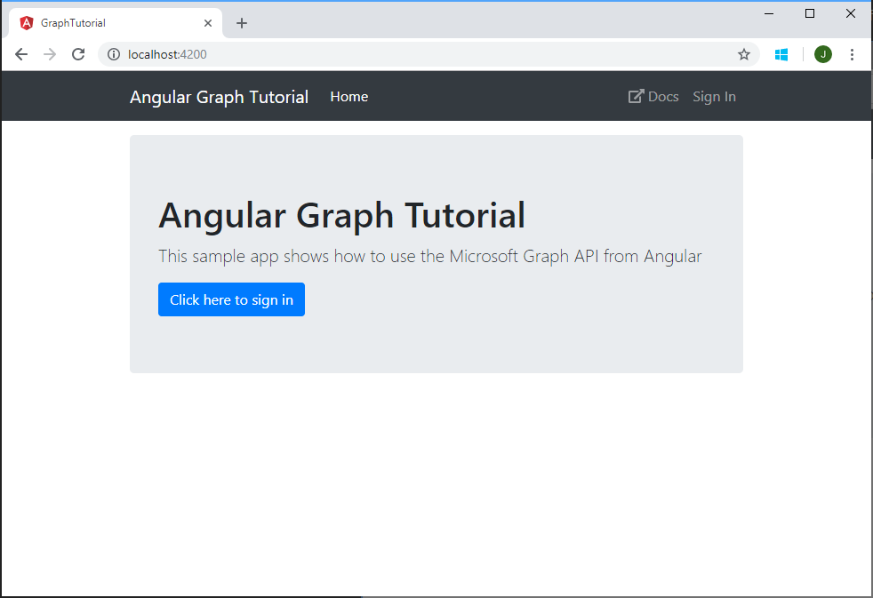

<!-- markdownlint-disable MD002 MD041 -->

In this section, you'll create a new Angular project.

1. Open your command-line interface (CLI), navigate to a directory where you have rights to create files, and run the following commands to install the [Angular CLI](https://www.npmjs.com/package/@angular/cli) tool and create a new Angular app.

    ```Shell
    npm install -g @angular/cli@9.0.6
    ng new graph-tutorial
    ```

1. The Angular CLI will prompt for more information. Answer the prompts as follows.

    ```Shell
    ? Would you like to add Angular routing? Yes
    ? Which stylesheet format would you like to use? CSS
    ```

1. Once the command finishes, change to the `graph-tutorial` directory in your CLI and run the following command to start a local web server.

    ```Shell
    ng serve --open
    ```

1. Your default browser opens to [https://localhost:4200/](https://localhost:4200) with a default Angular page. If your browser doesn't open, open it and browse to [https://localhost:4200/](https://localhost:4200) to verify that the new app works.

## Add Node packages

Before moving on, install some additional packages that you will use later:

- [bootstrap](https://github.com/twbs/bootstrap) for styling and common components.
- [ng-bootstrap](https://github.com/ng-bootstrap/ng-bootstrap) for using Bootstrap components from Angular.
- [angular-fontawesome](https://github.com/FortAwesome/angular-fontawesome) to use FontAwesome icons in Angular.
- [fontawesome-svg-core](https://github.com/FortAwesome/Font-Awesome), [free-regular-svg-icons](https://github.com/FortAwesome/Font-Awesome), and [free-solid-svg-icons](https://github.com/FortAwesome/Font-Awesome) for the FontAwesome icons used in the sample.
- [moment](https://github.com/moment/moment) for formatting dates and times.
- [msal-angular](https://github.com/AzureAD/microsoft-authentication-library-for-js/blob/dev/lib/msal-angular/README.md) for authenticating to Azure Active Directory and retrieving access tokens.
- [microsoft-graph-client](https://github.com/microsoftgraph/msgraph-sdk-javascript) for making calls to Microsoft Graph.

1. Run the following commands in your CLI.

    ```Shell
    npm install bootstrap@4.4.1 @fortawesome/angular-fontawesome@0.6.0 @fortawesome/fontawesome-svg-core@1.2.27
    npm install @fortawesome/free-regular-svg-icons@5.12.1 @fortawesome/free-solid-svg-icons@5.12.1
    npm install moment@2.24.0 moment-timezone@0.5.28 @ng-bootstrap/ng-bootstrap@6.0.0
    npm install msal@1.2.1 @azure/msal-angular@1.0.0-beta.4 @microsoft/microsoft-graph-client@2.0.0
    ```

1. Run the following command in your CLI to add the Angular localization package (required by ng-bootstrap).

    ```Shell
    ng add @angular/localize
    ```

## Design the app

In this section you'll create the user interface for the app.

1. Open the `./src/styles.css` and add the following lines.

    :::code language="css" source="../demo/graph-tutorial/src/styles.css":::

1. Add the Bootstrap and FontAwesome modules to the app. Open `./src/app/app.module.ts` and replace its contents with the following.

    ```TypeScript
    import { BrowserModule } from '@angular/platform-browser';
    import { NgModule } from '@angular/core';
    import { NgbModule } from '@ng-bootstrap/ng-bootstrap';
    import { FontAwesomeModule, FaIconLibrary } from '@fortawesome/angular-fontawesome';
    import { faExternalLinkAlt } from '@fortawesome/free-solid-svg-icons';
    import { faUserCircle } from '@fortawesome/free-regular-svg-icons';

    import { AppRoutingModule } from './app-routing.module';
    import { AppComponent } from './app.component';
    import { NavBarComponent } from './nav-bar/nav-bar.component';
    import { HomeComponent } from './home/home.component';
    import { AlertsComponent } from './alerts/alerts.component';

    @NgModule({
      declarations: [
        AppComponent,
        NavBarComponent,
        HomeComponent,
        AlertsComponent
      ],
      imports: [
        BrowserModule,
        AppRoutingModule,
        NgbModule,
        FontAwesomeModule
      ],
      providers: [],
      bootstrap: [AppComponent]
    })
    export class AppModule {
      constructor(library: FaIconLibrary) {
        // Register the FontAwesome icons used by the app
        library.addIcons(faExternalLinkAlt, faUserCircle);
      }
     }
    ```

1. Create a new file in the `./src/app` folder named `user.ts` and add the following code.

    :::code language="typescript" source="../demo/graph-tutorial/src/app/user.ts" id="user":::

1. Generate an Angular component for the top navigation on the page. In your CLI, run the following command.

    ```Shell
    ng generate component nav-bar
    ```

1. Once the command completes, open the `./src/app/nav-bar/nav-bar.component.ts` file and replace its contents with the following.

    ```TypeScript
    import { Component, OnInit } from '@angular/core';

    import { User } from '../user';

    @Component({
      selector: 'app-nav-bar',
      templateUrl: './nav-bar.component.html',
      styleUrls: ['./nav-bar.component.css']
    })
    export class NavBarComponent implements OnInit {

      // Should the collapsed nav show?
      showNav: boolean;
      // Is a user logged in?
      authenticated: boolean;
      // The user
      user: User;

      constructor() { }

      ngOnInit() {
        this.showNav = false;
        this.authenticated = false;
        this.user = null;
      }

      // Used by the Bootstrap navbar-toggler button to hide/show
      // the nav in a collapsed state
      toggleNavBar(): void {
        this.showNav = !this.showNav;
      }

      signIn(): void {
        // Temporary
        this.authenticated = true;
        this.user = {
          displayName: 'Adele Vance',
          email: 'AdeleV@contoso.com',
          avatar: null
        };
      }

      signOut(): void {
        // Temporary
        this.authenticated = false;
        this.user = null;
      }
    }
    ```

1. Open the `./src/app/nav-bar/nav-bar.component.html` file and replace its contents with the following.

    :::code language="html" source="../demo/graph-tutorial/src/app/nav-bar/nav-bar.component.html" id="navHtml":::

1. Create a home page for the app. Run the following command in your CLI.

    ```Shell
    ng generate component home
    ```

1. Once the command completes, open the `./src/app/home/home.component.ts` file and replace its contents with the following.

    ```TypeScript
    import { Component, OnInit } from '@angular/core';

    import { User } from '../user';

    @Component({
      selector: 'app-home',
      templateUrl: './home.component.html',
      styleUrls: ['./home.component.css']
    })
    export class HomeComponent implements OnInit {

      // Is a user logged in?
      authenticated: boolean;
      // The user
      user: any;

      constructor() { }

      ngOnInit() {
        this.authenticated = false;
        this.user = {};
      }

      signIn(): void {
        // Temporary
        this.authenticated = true;
        this.user = {
          displayName: 'Adele Vance',
          email: 'AdeleV@contoso.com'
        };
      }
    }
    ```

1. Open the `./src/app/home/home.component.html` file and replace its contents with the following.

    :::code language="html" source="../demo/graph-tutorial/src/app/home/home.component.html" id="homeHtml":::

1. Create a simple `Alert` class. Create a new file in the `./src/app` directory named `alert.ts` and add the following code.

    :::code language="typescript" source="../demo/graph-tutorial/src/app/alert.ts" id="alert":::

1. Create an alert service that the app can use to display messages to the user. In your CLI, run the following command.

    ```Shell
    ng generate service alerts
    ```

1. Open the `./src/app/alerts.service.ts` file and replace its contents with the following.

    :::code language="typescript" source="../demo/graph-tutorial/src/app/alerts.service.ts" id="alertsService":::

1. Generate an alerts component to display alerts. In your CLI, run the following command.

    ```Shell
    ng generate component alerts
    ```

1. Once the command completes, open the `./src/app/alerts/alerts.component.ts` file and replace its contents with the following.

    :::code language="typescript" source="../demo/graph-tutorial/src/app/alerts/alerts.component.ts" id="alertComponent":::

1. Open the `./src/app/alerts/alerts.component.html` file and replace its contents with the following.

    :::code language="html" source="../demo/graph-tutorial/src/app/alerts/alerts.component.html" id="alertHtml":::

1. Open the `./src/app/app-routing.module.ts` file and replace the `const routes: Routes = [];` line with the following code.

    ```typescript
    import { HomeComponent } from './home/home.component';

    const routes: Routes = [
      { path: '', component: HomeComponent },
    ];
    ```

1. Open the `./src/app/app.component.html` file and replace its entire contents with the following.

    :::code language="html" source="../demo/graph-tutorial/src/app/app.component.html" id="appHtml":::

Save all of your changes and refresh the page. Now, the app should look very different.


