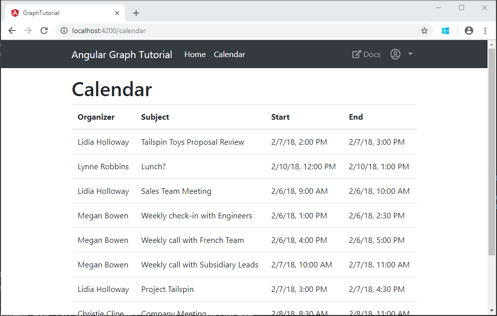

<!-- markdownlint-disable MD002 MD041 -->

In this exercise you will incorporate the Microsoft Graph into the application. For this application, you will use the [microsoft-graph-client](https://github.com/microsoftgraph/msgraph-sdk-javascript) library to make calls to Microsoft Graph.

## Get calendar events from Outlook

1. Create a new file in the `./src/app` directory called `event.ts` and add the following code.

    ```TypeScript
    // For a full list of fields, see
    // https://docs.microsoft.com/graph/api/resources/event?view=graph-rest-1.0
    export class Event {
      subject: string;
      organizer: Recipient;
      start: DateTimeTimeZone;
      end: DateTimeTimeZone;
    }

    // https://docs.microsoft.com/graph/api/resources/recipient?view=graph-rest-1.0
    export class Recipient {
      emailAddress: EmailAddress;
    }

    // https://docs.microsoft.com/graph/api/resources/emailaddress?view=graph-rest-1.0
    export class EmailAddress {
      name: string;
      address: string;
    }

    // https://docs.microsoft.com/graph/api/resources/datetimetimezone?view=graph-rest-1.0
    export class DateTimeTimeZone {
      dateTime: string;
      timeZone: string;
    }
    ```

1. Add a new service to hold all of your Graph calls. Run the following command in your CLI.

    ```Shell
    ng generate service graph
    ```

    Just as with the authentication service you created earlier, creating a service for this allows you to inject it into any components that need access to Microsoft Graph.

1. Once the command completes, open the `./src/app/graph.service.ts` file and replace its contents with the following.

    ```TypeScript
    import { Injectable } from '@angular/core';
    import { Client } from '@microsoft/microsoft-graph-client';

    import { AuthService } from './auth.service';
    import { Event } from './event';
    import { AlertsService } from './alerts.service';

    @Injectable({
      providedIn: 'root'
    })
    export class GraphService {

      private graphClient: Client;
      constructor(
        private authService: AuthService,
        private alertsService: AlertsService) {

        // Initialize the Graph client
        this.graphClient = Client.init({
          authProvider: async (done) => {
            // Get the token from the auth service
            let token = await this.authService.getAccessToken()
              .catch((reason) => {
                done(reason, null);
              });

            if (token)
            {
              done(null, token);
            } else {
              done("Could not get an access token", null);
            }
          }
        });
      }

      async getEvents(): Promise<Event[]> {
        try {
          let result =  await this.graphClient
            .api('/me/events')
            .select('subject,organizer,start,end')
            .orderby('createdDateTime DESC')
            .get();

          return result.value;
        } catch (error) {
          this.alertsService.add('Could not get events', JSON.stringify(error, null, 2));
        }
      }
    }
    ```

    Consider what this code is doing.

    - It initializes a Graph client in the constructor for the service.
    - It implements a `getEvents` function that uses the Graph client in the following way:
      - The URL that will be called is `/me/events`.
      - The `select` method limits the fields returned for each events to just those the view will actually use.
      - The `orderby` method sorts the results by the date and time they were created, with the most recent item being first.

1. Create an Angular component to call this new method and display the results of the call. Run the following command in your CLI.

    ```Shell
    ng generate component calendar
    ```

1. Once the command completes, add the component to the `routes` array in `./src/app/app-routing.module.ts`.

    ```TypeScript
    import { CalendarComponent } from './calendar/calendar.component';

    const routes: Routes = [
      { path: '', component: HomeComponent },
      { path: 'calendar', component: CalendarComponent }
    ];
    ```

1. Open the `./src/app/calendar/calendar.component.ts` file and replace its contents with the following.

    ```TypeScript
    import { Component, OnInit } from '@angular/core';
    import * as moment from 'moment-timezone';

    import { GraphService } from '../graph.service';
    import { Event, DateTimeTimeZone } from '../event';
    import { AlertsService } from '../alerts.service';

    @Component({
      selector: 'app-calendar',
      templateUrl: './calendar.component.html',
      styleUrls: ['./calendar.component.css']
    })
    export class CalendarComponent implements OnInit {

      public events: Event[];

      constructor(
        private graphService: GraphService,
        private alertsService: AlertsService) { }

      ngOnInit() {
        this.graphService.getEvents()
          .then((events) => {
            this.events = events;
            // Temporary to display raw results
            this.alertsService.add('Events from Graph', JSON.stringify(events, null, 2));
          });
      }
    }
    ```

For now this just renders the array of events in JSON on the page. Save your changes and restart the app. Sign in and click the **Calendar** link in the nav bar. If everything works, you should see a JSON dump of events on the user's calendar.

## Display the results

Now you can update the `CalendarComponent` component to display the events in a more user-friendly manner.

1. Remove the temporary code that adds an alert from the `ngOnInit` function. Your updated function should look like this.

    ```TypeScript
    ngOnInit() {
      this.graphService.getEvents()
        .then((events) => {
          this.events = events;
        });
    }
    ```

1. Add a function to the `CalendarComponent` class to format a `DateTimeTimeZone` object into an ISO string.

    ```TypeScript
    formatDateTimeTimeZone(dateTime: DateTimeTimeZone): string {
      try {
        return moment.tz(dateTime.dateTime, dateTime.timeZone).format();
      }
      catch(error) {
        this.alertsService.add('DateTimeTimeZone conversion error', JSON.stringify(error));
      }
    }
    ```

1. Open the `./src/app/calendar/calendar.component.html` file and replace its contents with the following.

    ```html
    <h1>Calendar</h1>
    <table class="table">
      <thead>
        <th scope="col">Organizer</th>
        <th scope="col">Subject</th>
        <th scope="col">Start</th>
        <th scope="col">End</th>
      </thead>
      <tbody>
        <tr *ngFor="let event of events">
          <td>{{event.organizer.emailAddress.name}}</td>
          <td>{{event.subject}}</td>
          <td>{{formatDateTimeTimeZone(event.start) | date:'short' }}</td>
          <td>{{formatDateTimeTimeZone(event.end) | date: 'short' }}</td>
        </tr>
      </tbody>
    </table>
    ```

This loops through the collection of events and adds a table row for each one. Save the changes and restart the app. Click on the **Calendar** link and the app should now render a table of events.


